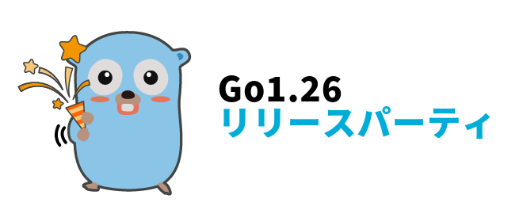
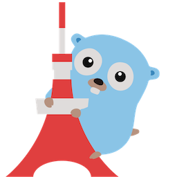
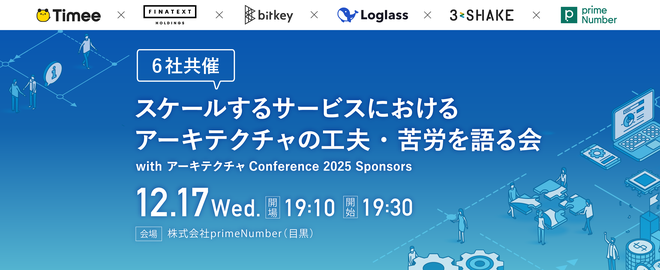
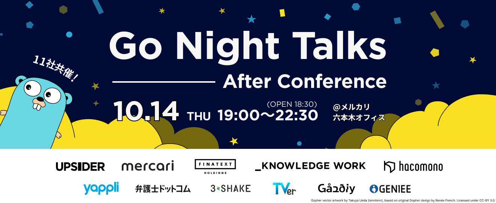

# presentations

## [2026-02-25] [そのエラー本当に必要ですか？](https://sollniss.github.io/presentations/20260225_release.party/)

### Event: [Go 1.26 リリースパーティ](https://gocon.connpass.com/event/381405/)

## [2026-02-18] [Goのコードを数学的に証明する](https://sollniss.github.io/presentations/20260218_golang.tokyo.43/)

### Event: [golang.tokyo #43](https://golangtokyo.connpass.com/event/374860/)

## [2025-12-17] [SaaSの基幹システムをモジュラーモノリスとして再設計](https://sollniss.github.io/presentations/20251217_prime/)

### Event: [スケールするサービスにおけるアーキテクチャの工夫・苦労を語る会](https://timeedev.connpass.com/event/376592/)

## [2025-12-16] [映えるGoコード: CSSで柔軟にカスタマイズできるコードハイライトツールの紹介](https://sollniss.github.io/presentations/20251216_golang.tokyo.42/)

### Event: [golang.tokyo #42](https://golangtokyo.connpass.com/event/377276/)

## [2025-10-14] [呼び出し漏れリンターを作ろうとした結果](https://sollniss.github.io/presentations/20251014_GoNightTalks/)

### Event: [Go Night Talks - After Conference](https://mercari.connpass.com/event/367075/)

## [2025-09-16] [Gofix を知っていますか？](https://sollniss.github.io/presentations/20250916_pepabo/)

### Event: [GMOペパボ & GO 〜 夏のGo祭り2025、あの夏〜](https://pepabo.connpass.com/event/363869/)

